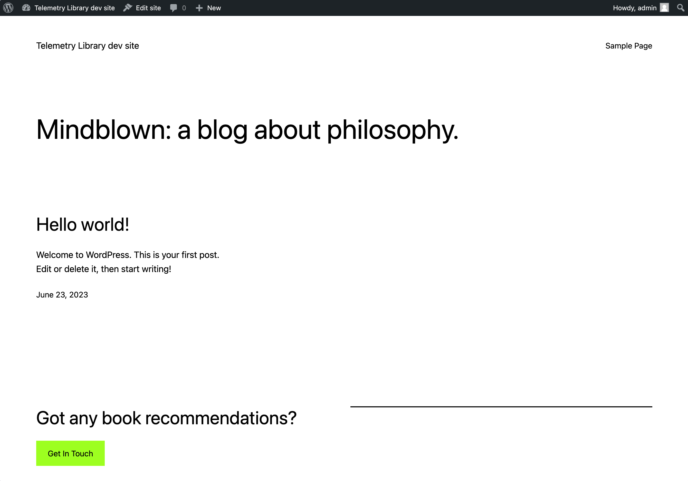
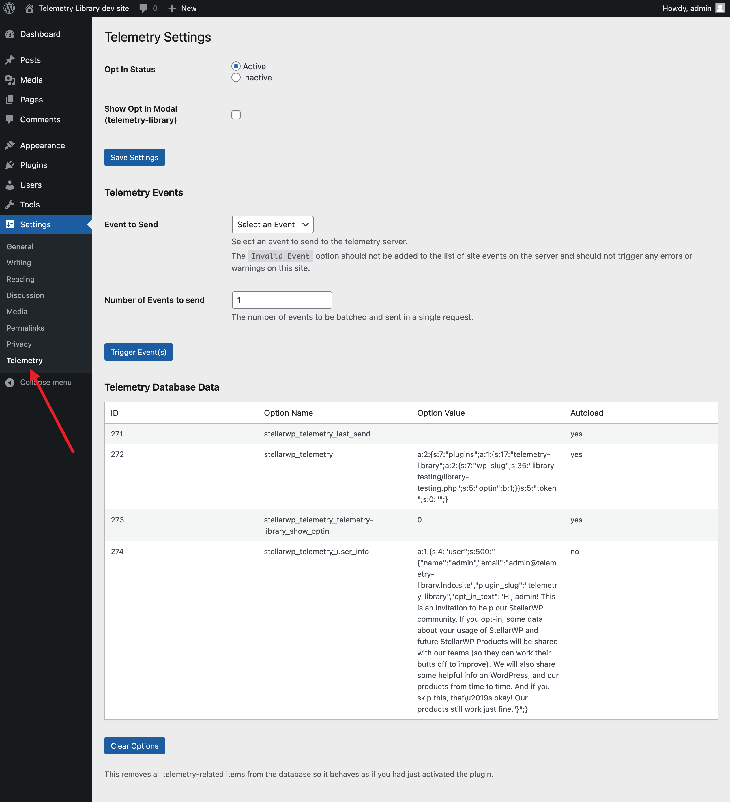

# Local Environment Configuration

This library uses Lando for its preferred local environment.

## Quick Start
1. Install [Lando](https://lando.dev) (if you don't already have it installed)
2. Run `Lando start` in your local copy of the repository

Once lando starts, you should have a fresh environment running at [https://telemetry-library.lndo.site/](https://telemetry-library.lndo.site/)




This environment has a default plugin that provides several tools to test the different aspects of the library. As features are added, the plugin should be updated with features to test new functionality.



## Xdebug with VS Code

Since the local environment uses some symlinked directories in lando's appserver container, you'll need a unique config to point Xdebug to the correct location on your machine.

Create a new `.vscode/launch.json` file and add this:
```json
"version": "0.2.0",
  "configurations": [
    {
      "name": "Listen for Xdebug",
      "type": "php",
      "request": "launch",
      "port": 9003,
      "pathMappings": {
		// With this path mapping, Xdebug will stop on breakpoints in your workspace root.
        "/app/dev/public/wp-content/plugins/library-testing/lib": "${workspaceRoot}"
      }
    }
  ]
```
